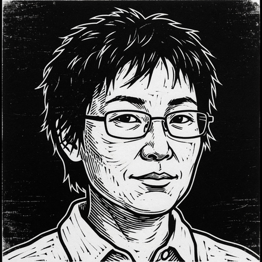

# preo

<p align="center">
  
</p>

<p align="center"><em>말은 없다. 한 문장 고친다. 읽힌다.</em></p>

<p align="center">풀어. 한국어 기술문서의 꼬인 문장을 풉니다.</p>

규칙은 후보이고, 아직 확정 표준이 아닙니다. 규칙 ID의 `KSTL-`은 식별자일 뿐입니다.

## Before / after

```
설정 파일이 로드되어지면 캐시가 갱신되어집니다.
배포에 대한 절차는 문서를 통해 확인합니다.
만료된 경우 토큰을 재발급합니다.
```

```
설정 파일이 로드되면 캐시가 갱신됩니다.
배포 절차는 문서에서 확인합니다.
만료되면 토큰을 재발급합니다.
```

## 설치

저장소가 private이라 GitHub 마켓플레이스 설치는 안 됩니다. 클론한 뒤 경로로 넣습니다.

```
/plugin marketplace add /path/to/preo
/plugin install preo@preo
```

호출: "이 문서 풀어줘". 검사만: "검사만 해줘". 처음부터: "풀어로 써줘".

본문: [skill/preo/SKILL.md](skill/preo/SKILL.md). 규칙: [candidates.yaml](standard/rules/candidates.yaml).

## 이 저장소

preo는 국어 중심의 한국어 기술문서 규칙 초안과, 그 규칙으로 문장을 푸는 스킬입니다.

```bash
uv sync --locked
uv run pytest
uv run python scripts/validate_links.py
```

- 조사: [서지](research/bibliography.md), [주장](research/claims.yaml), [한국어 연구](research/korean-controlled-language.md), [언어 비교](research/language-comparison.md), [코퍼스 후보](research/corpus-sources.yaml)
- 제안: [표준 작업 공간](standard/README.md), [규칙 후보](standard/rules/candidates.yaml), [어휘 예시](standard/vocabulary/entries.yaml)
- 계약: [주장](schemas/claim.schema.json), [규칙](schemas/rule.schema.json), [어휘](schemas/vocabulary.schema.json), [코퍼스](schemas/corpus-source.schema.json)
- 절차: [Phase 0 점검표](docs/phase-0-checklist.md), [규칙 템플릿](docs/rule-template.md), [코퍼스 가이드](docs/corpus-guide.md), [인수인계](docs/HANDOFF.md)

설계·계획·파일럿: [Phase 0 설계](docs/superpowers/specs/2026-08-08-phase-0-research-foundation-design.md), [preo 설계](docs/superpowers/specs/2026-08-10-sulsul-skill-v0-design.md), [Phase 0 계획](docs/superpowers/plans/2026-08-08-phase-0-research-foundation.md), [preo 계획](docs/superpowers/plans/2026-08-10-sulsul-skill-v0.md), [dogfood](docs/pilot/2026-08-sulsul-dogfood.md), [외부](docs/pilot/2026-08-sulsul-external.md), [3자 비교](docs/pilot/2026-08-sulsul-comparison.md).

증거 표시(`verified` / `secondary` / `unverified` / `contradicted`)는 출처 강도일 뿐, 규칙 승인이 아닙니다.

> preo는 국어, 즉 한국어 기술문서가 중심인 독립 커뮤니티 프로젝트입니다.
> ASD 또는 STEMG와 제휴하거나 이들의 승인을 받은 프로젝트가 아닙니다.
> ASD-STE100은 비교용 참고자료일 뿐이며 규칙의 근거가 아닙니다.
> Issue 9 공식 사본 신청은 진행 조건이 아닙니다. 저작권이 있는 표준 원문이나
> 통제 사전을 재배포하지 않습니다.

제3자 원문은 커밋하지 않습니다. [로컬 원문 보관](research/sources/README.md), [라이선스 정책](LICENSES/README.md). 코드는 [Apache 2.0](LICENSE), 직접 작성한 문서·데이터는 [CC BY 4.0](LICENSES/CC-BY-4.0.txt). 기여는 [CONTRIBUTING.md](CONTRIBUTING.md).
